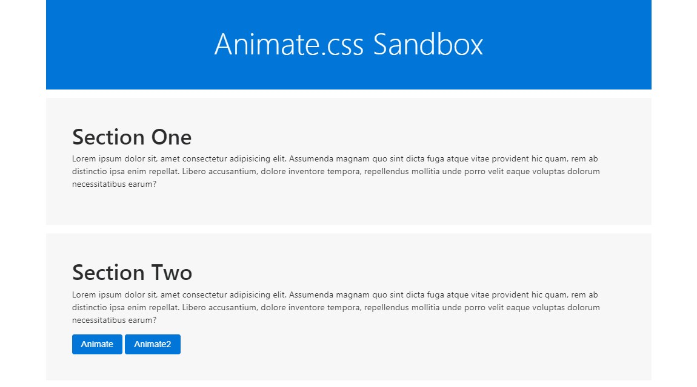

# [Get Started With Animate.css](https://www.youtube.com/watch?v=S2KCXKAView)

In this tutotial, we learn how to implement Animate.css which is a very easy way to add some animation to your websites and UIs. It is as simple as applying a class. We will learn how you can to trigger animations using JS and jQuery.

[View demo site here.](https://webdevtuts.github.io/get_started_with_animate_css/)

